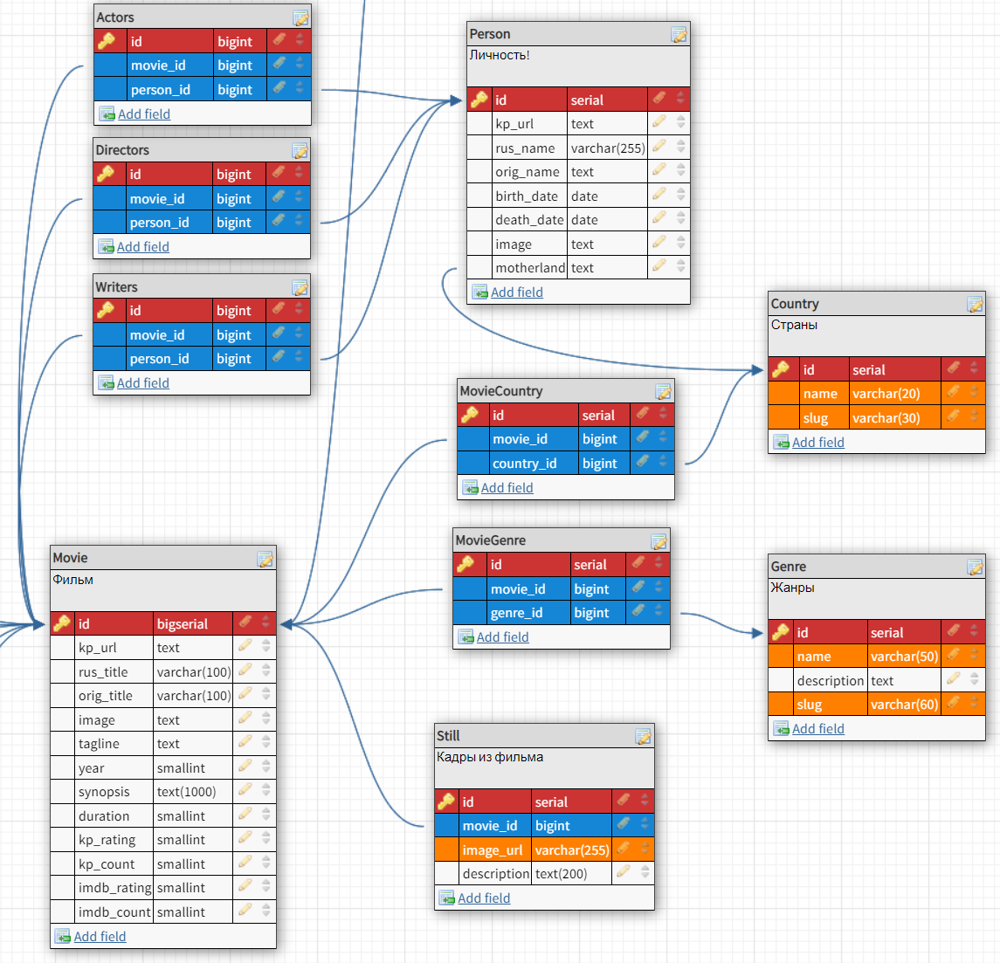

# ПАРСЕР ТОП 500 КИНОПОИСКА

Мультипроцессорный парсер кинопоиска (актуально на 20/03/2023).

Спарсенные данные преобразуются
в фикстуры для Django-приложения со следующией схемой БД:

## Инструкция

* `git clone https://github.com/coryphoenixxx/kinopoisk_top500_parser.git`
* создать виртуальное окружение
* `pip install -r requirements.txt`
* скопировать файл `.env.default`, переименовать его в `.env` и настроить параметры:
    * `PROCESS_NUM` — количество параллельных процессов (по дефолту = количеству ядер процессора хоста)
    * `MOVIES_LIST_NUM` — количество [страниц-списков с фильмами](https://www.kinopoisk.ru/lists/movies/top500/?page=1),
      которые нужно парсить
    * `STILLS_NUM` — количество кадров, которые нужно спарсить
    * `SCRAPE_LIMIT_COUNT` — ограничение количества посещенных страниц, после которого нужно сделать паузу
    * `SCRAPE_LIMIT_SLEEP` — пауза в секундах
* **!!!** если запускаете через IDE, то исключить папку `data` из индексирования,
  иначе IDE будет сильно тормозить работу скрипта
* `python __main__.py`
* при первом запуске нужно будет решить капчу Яндекса для каждого процесса
* во время работы скрипта окна вебдрайверов будут иногда перезагружаться — это нормально
* спарсенные данные будут складироваться в папку `data`
* после скрипт предложит подкорректировать криво заполненные страны
* результат работы (`data/fixtures.json` и папка `data/media`) нужно скопировать в django-проект (на уровень
  с `manage.py`)
  и загрузить фикстуры в БД: `python manage.py loaddata fixtures.json`

## Скорость

В 8 процессов на intel core i7 скрипт отрабатывает за 6-10 минут.

## Тех.стек

* python 3.10+
* multiprocessing
* aiohttp
* Selenium
* Beautiful Soup

## TODO:

* есть мнение, что Selenium немного быстрее работает с мультипоточкой